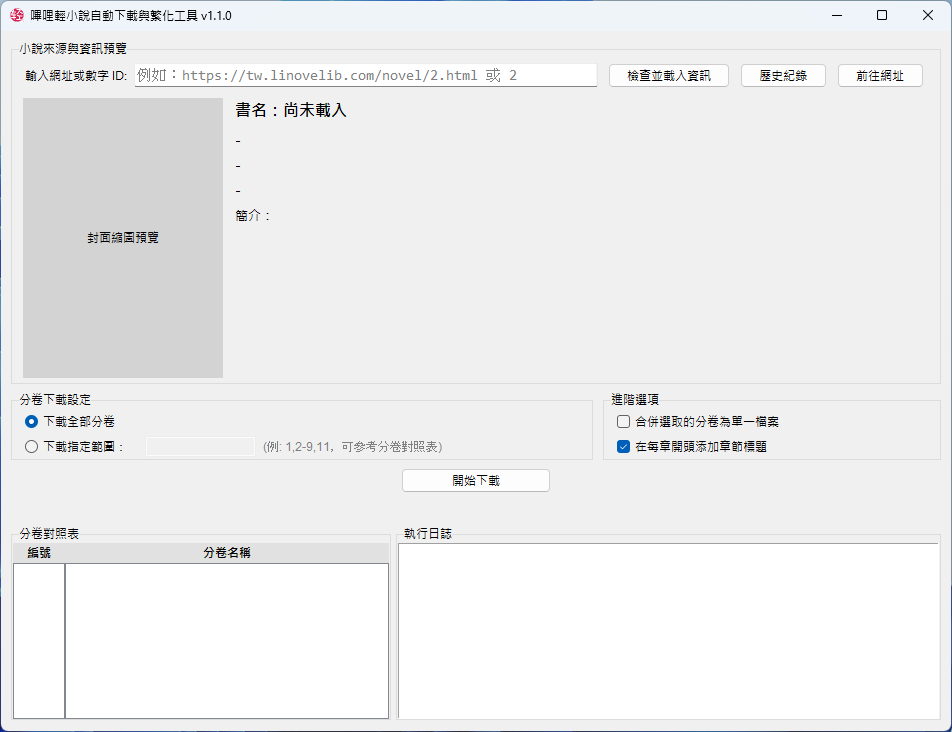
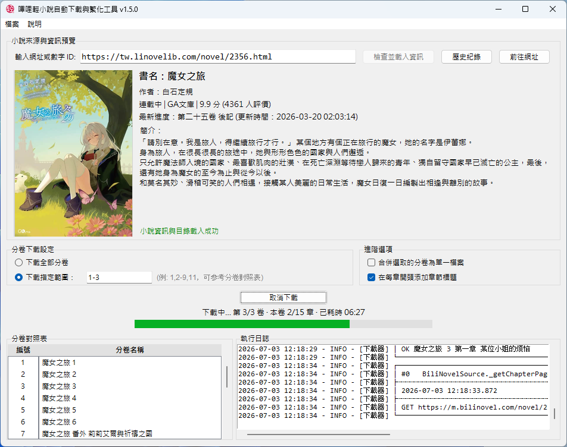
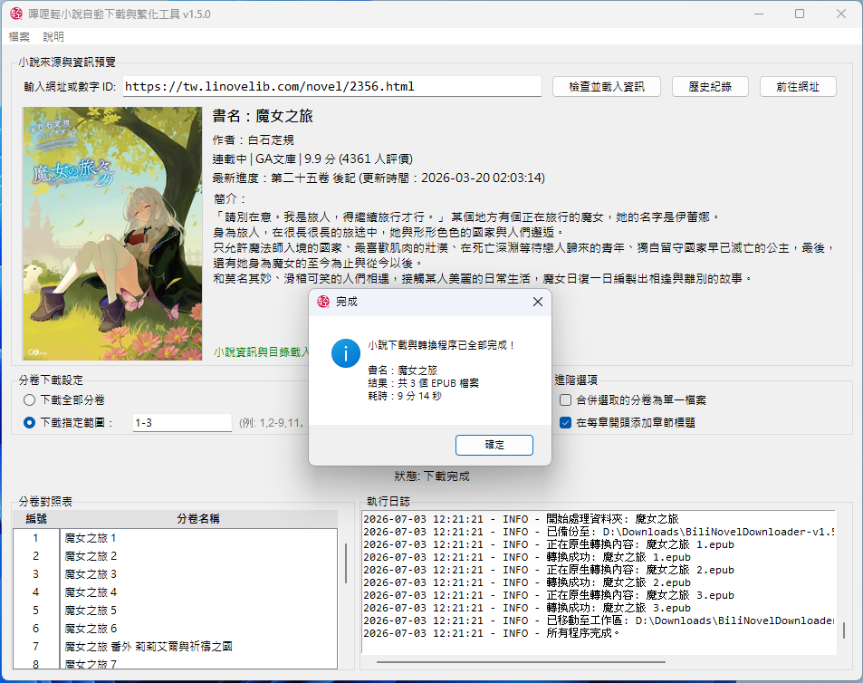

<p align="center">
   
</p>

<h1 align="center">嗶哩輕小說自動下載與繁化工具 (BiliNovelDownloader)</h1>

基於 [bili_novel_packer](https://github.com/Montaro2017/bili_novel_packer) 核心打造的圖形化介面工具，專為 [嗶哩輕小說](https://tw.linovelib.com/) 而設計。支援小說資訊預覽、全自動下載及 EPUB 簡繁轉換。

## 預覽







## 特色與功能

*   **圖形介面**：貼上網址或數字 ID 即可預覽小說資訊（封面、簡介、目錄）
*   **簡繁轉換**：原站僅提供簡體版，程式下載完成後自動透過 `opencc` 轉換，同時輸出簡體與繁體兩份 EPUB（含資料夾與檔案名稱），分別存放於 `downloads/簡體/` 與 `downloads/繁體/`
*   **即時狀態追蹤**：內建執行日誌與進度提示，及時查看下載資訊、錯誤訊息
*   **分卷下載**：可選下載 **全部範圍** 或 **指定範圍**（例如：`1, 3-5, 9`）
*   **進階整合選項**：可選擇「合併選取的分卷為單一檔案」，或是「在每章開頭自動添加章節標題」
*   **下載歷史紀錄**：自動儲存近期載入過的小說網址，點擊下拉選單即可重新載入
*   **智慧快取機制**：書籍封面圖片自動快取 24 小時，提升二次載入速度

## 如何使用

**系統需求**：Windows 10 / 11（64 位元）

1. 前往 [Releases 頁面](https://github.com/allen3206/BiliNovelDownloader/releases) 下載最新的 `.zip` 壓縮檔
2. 將下載的壓縮檔 **解壓縮** 到電腦中（例如：桌面或 D 槽）
3. 打開解壓縮後的資料夾，會看到以下結構：
   ```text
   BiliNovelDownloader-...-windows-x64/
   ├── BiliNovelDownloader.exe             (主程式)
   ├── readme.txt                             (使用須知)
   ├── LICENSE.txt
   ├── NOTICES.txt
   ├── THIRD_PARTY_LICENSES.txt
   └── tools/
       ├── bili_novel_packer-xxx-windows.exe  (核心下載器)
       └── LICENSE-bili_novel_packer.txt
   ```
4. **雙擊 `BiliNovelDownloader.exe` 即可開始使用**

下載完成後，檔案會存放於以下結構：
```text
downloads/
├── 簡體/
│   └── 書名/
│       ├── 書名 第1卷.epub
│       └── 書名 第2卷.epub
└── 繁體/
    └── 書名/
        ├── 書名 第1卷.epub
        └── 書名 第2卷.epub
```

> **提醒：**
> *   不要在未解壓縮的 ZIP 檔內直接執行程式
> *   請務必保持 `exe` 主程式與 `tools` 資料夾在同一層目錄下。如果想將捷徑放在桌面，請對 `exe` 按右鍵選擇「建立捷徑」並移至桌面，切勿單獨將 exe 檔案移走

## 授權與聲明

*   授權條款：[MIT License](LICENSE)
*   本專案核心下載功能使用 [bili_novel_packer](https://github.com/Montaro2017/bili_novel_packer)
*   本工具僅供學習與交流使用，請勿用於商業用途或大量惡意抓取

## 下載器核心更新

如果未來遇到可用的更新版本：

1. 前往核心下載器原作者的 GitHub：[Montaro2017/bili_novel_packer](https://github.com/Montaro2017/bili_novel_packer/releases)
2. 下載最新版本的 `bili_novel_packer-...-windows.exe`
3. 移除舊版本下載器，將下載的新檔案移至本工具 `tools` 資料夾內即可正常運作

---

## 原始碼

如想修改程式碼，請參考以下說明：

### 環境準備

1. 建議使用 Python 3.10 以上
2. 安裝必要的套件：
   ```bash
   pip install -r requirements.txt
   ```

### 直接執行腳本

在專案根目錄下執行：
```bash
python BiliNovelDownloader.py
```

### 打包成 exe

```bash
pyinstaller BiliNovelDownloader.spec
```